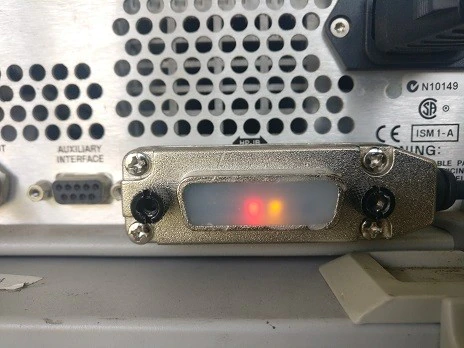
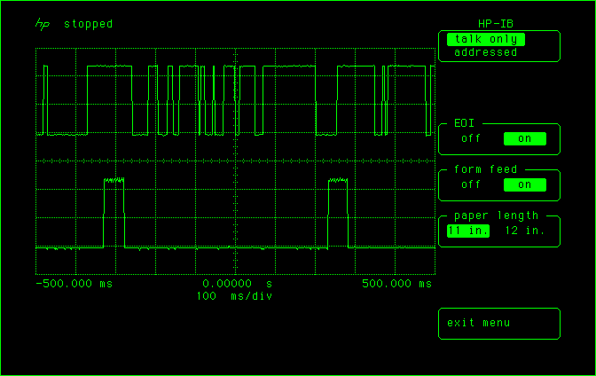

This is a minimal simulation of an HP2671 thermal printer to support older HP instruments, it runs under Linux as a console-mode program.

Input is via a Fenrir/Prologix-subset adapter as sold for example by https://www.aliexpress.com/store/5256129?spm=a2g0o.detail.1000007.1.77305be17cn6AE Since this is to at least some extent a clone of- or at least a "homage to"- a commercial product, please do not direct support questions to Prologix unless you are prepared to purchase one of their own adapters.

Input may be text (e.g. from an HP1630G logic analyzer) or bitmap (e.g. from an HP54501A 'scope), other devices have not been tested. In the case of graphical input the output is a .bmp file, command line options provide minimal support for colour and outline definition.

Vendor image:

Logic analyzer GPIB setup:

<pre>System Specification____________________________________________

[___Peripherals____]

Clock set: [Jan] 00 0000  00:00:00

HP-IL: Inactive
HP-IB: 1630G is controller
Logic analyzer HP-IB address: 04
Printer HP-IB address:        01
Disc HP-IB address:           00 No Disc

Print non-waveform menus in: [__text__]
Rear panel port: [_______constant_low________]
Beeper: [on_]

Autoload configuration from internal storage: [yes]

Save configuration in internal storage: [no_]
</pre>

Logic analyzer capture:

'Scope setup and capture:

